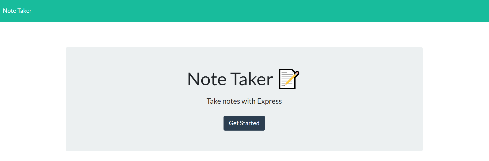
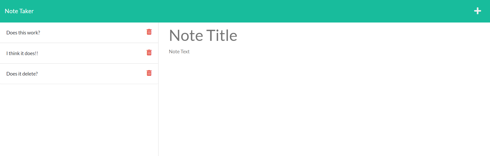

# Express.js: Note Taker

## Project Description

Modify starter code to create an application called Note Taker that can be used to write and save notes. This application will use an Express.js back end and will save and retrieve note data from a JSON file.

[Express](https://www.npmjs.com/package/express)

Install Express in Terminal
```
npm i express
```
[Guide on how to use middleware framework Express](https://expressjs.com/en/guide/using-middleware.html)

## Main Objective

The application’s front end has already been created. The task is to build the back end, connect the two, and then deploy the entire application to **Heroku**.

[To install the Heroku CLI](https://coding-boot-camp.github.io/full-stack/heroku/how-to-install-the-heroku-cli)

Once Heroku has been installed, verify Heroku was installed on Terminal
```
heroku --version
```
Once Heroku is verified on Terminal, check your git is installed. 
```
git --version
```

[Heroku documentation on getting started with Node.js](https://devcenter.heroku.com/articles/getting-started-with-nodejs?singlepage=true)

To direct your project to your heroku account
```
heroku login or heroku login i
cd ~/ PROJECT LOCATION
heroku create
```

[To deploy a project on Heroku](https://coding-boot-camp.github.io/full-stack/heroku/heroku-deployment-guide)
Create a variable to locate Port
```
const port = process.env.PORT || 3001
```

```Terminal
git status
git init
heroku create
git remote -v
git add -A
git commit -m "Pushing to Heroku"
git push heroku main
```

To open the application from the terminal
```
heroku open
```

[Heroku documentation on creating a Heroku remote](https://devcenter.heroku.com/articles/git#creating-a-heroku-remote)
To confirm there is a remote name heroku set on your app
```
git remote -v
```

## Items Completed in the project

✅ When the application landing page is opened there is a link to a notes page that can be clicked.

✅ The note page contains:

* existing notes in the left-hand column.
* empty fields to enter a new note title & note's texts in the right-hand column.

✅ When the `save icon` at the top of the page is clicked the new note title and the note's text are saved with the existing notes.

✅ When the `write icon` at the top of the page is clicked the user is presented with a way to write notes.

✅ When the `delete icon` at the top of the page is clicked the user is presented with a way to delete notes.

## Hints

On the back end, the application should include a `db.json` file that will be used to store and retrieve notes using the `fs` module.

The following HTML routes should be created:

* `GET /notes` should return the `notes.html` file.

* `GET *` should return the `index.html` file.

The following API routes should be created:

* `GET /api/notes` should read the `db.json` file and return all saved notes as JSON.

* `POST /api/notes` should receive a new note to save on the request body, add it to the `db.json` file, and then return the new note to the client. You'll need to find a way to give each note a unique id when it's saved (look into npm packages that could do this for you).

* `DELETE /api/notes/:id` should receive a query parameter that contains the id of a note to delete. To delete a note, you'll need to read all notes from the `db.json` file, remove the note with the given `id` property, and then rewrite the notes to the `db.json` file.

## Live URL

[Heroku](https://rocky-shore-91173.herokuapp.com/)

## Screenshot



## Credits
[youtube](https://www.youtube.com/watch?v=TbPuddYvspk&ab_channel=jhf1203)

- - -
[](https://opensource.org/licenses/ISC)

Permission to use, copy, modify, and/or distribute this software for any purpose with or without fee is hereby granted, provided that the above copyright notice and this permission notice appear in all copies.